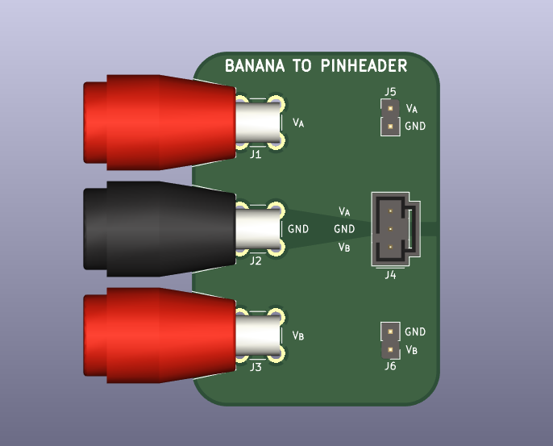

# Banana to Pinheader Adapter

Convenience board for connecting banana cables (e.g. from a power supply) to a
Molex SL pinheader for interfacing with projects. Simplifies powering projects
from a bench power supply.

Provides three connections: V_A, V_B, and GND. These are intended for positive
and negative supplies with a center ground but they can be used arbitrarily.

Also provides testpoints for all three connections.

## BOM
| Refdes | Description | Manufacturer PN | Comments |
| ------ | ----------- | --------------- | -------- |
| J1, J2, J3 | Banana Jack | Caltest CT3151 | pick color as desired |
| J4 | Molex SL connector | Molex 70543-0002 | |
| J5, J6 | Testpoints | n/a | use generic 0.1" breakaway header, or omit. |

## License
This work is licensed under a [Creative Commons Attribution-ShareAlike 4.0
International License][cc-by-sa].

[![CC BY-SA 4.0][cc-by-sa-image]][cc-by-sa]

[cc-by-sa]: http://creativecommons.org/licenses/by-sa/4.0/
[cc-by-sa-image]: https://licensebuttons.net/l/by-sa/4.0/88x31.png
[cc-by-sa-shield]: https://img.shields.io/badge/License-CC%20BY--SA%204.0-lightgrey.svg
